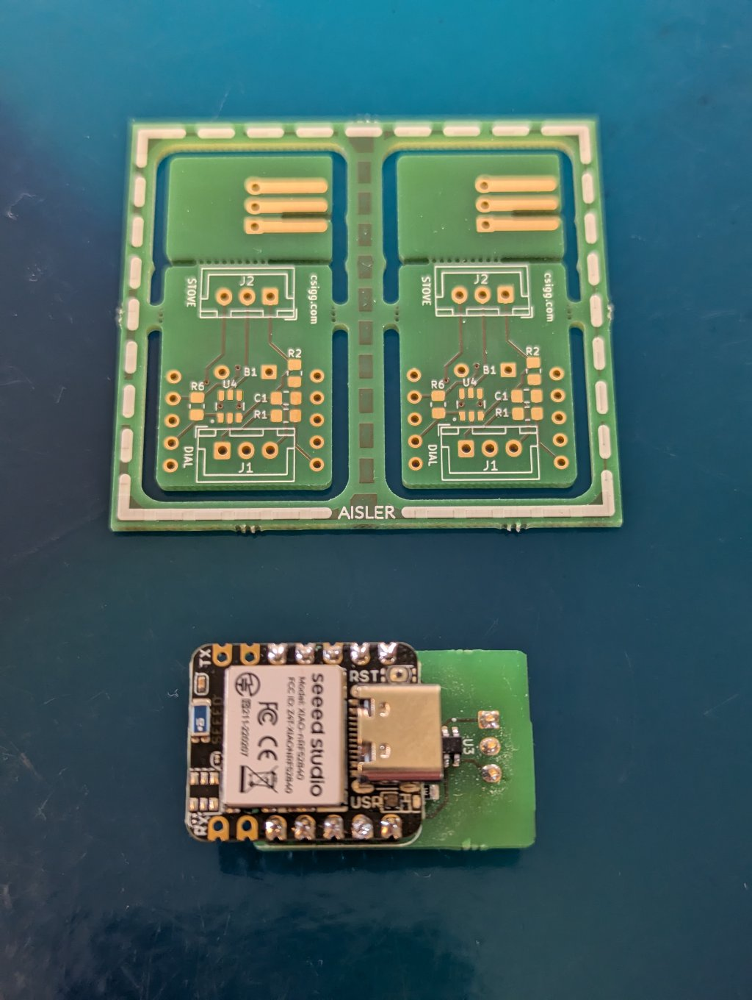
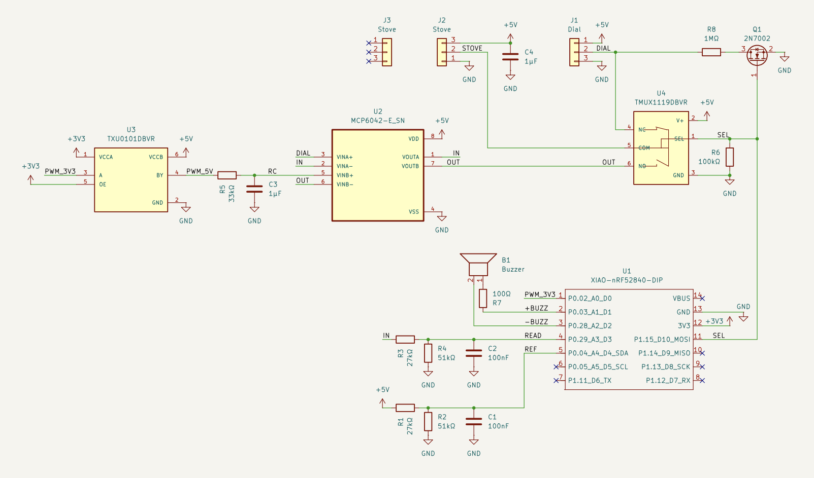
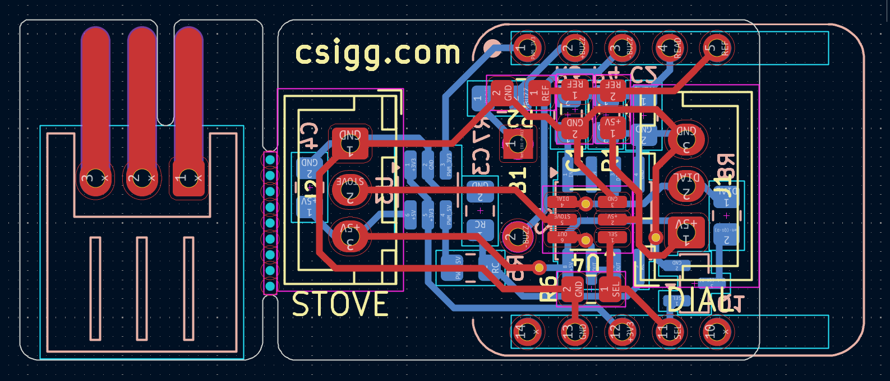

# KRC Interposer



The KRC Interposer is a hardware intermediary that converts a standard induction stove dial into a closed-loop temperature controller. It is designed for use with Kuhn Rikon Comfort (KRC) cookware, such as the Duromatic pressure cooker or Hotpan. The interposer intercepts the analog signal from the stove’s physical knob, connects to the cookware lid via Bluetooth Low Energy (BLE), and regulates the stove's power output to maintain a target temperature.

The system is built around the Seeed Studio XIAO nRF52840 microcontroller. It is designed to have no effect during standard stove operation, activating only when smart temperature control is initiated.

## Operating Modes

### Wake and Connection
Smart features are triggered by turning the dial to the stove's built-in **Boil Mode** (below 0). The resulting resistance change is detected by a companion PIC microcontroller, which then wakes the XIAO via serial communication (UART RX).

The microcontroller then takes control of the analog switch, routing its own filtered PWM output to the stove in place of the physical dial. It enters a scanning state to locate a Kuhn Rikon Comfort lid via BLE. Upon successful connection, the device emits an audible beep.

### Active Temperature Control
Once connected, the physical dial's positions are repurposed:
*   **Off:** Pauses heating and acts as an "Off" switch.
*   **1 to 9:** Maps to a target temperature range between 30°C and 120°C.

The interposer reads the current temperature from the BLE lid and uses a proportional-predictive thermal model (with feed-forward heat loss compensation) to simulate the required analog voltage to the stove. It automatically utilizes the stove's native hardware boost modes for rapid heating. A slew-rate limiter ensures smooth voltage transitions to prevent hardware faults on the stove's internal controller.

### Safety and Shutdown
*   **Signal Loss:** If the BLE connection drops, the interposer emits a warning beep and eventually reduces stove power to a safe minimum until the connection is restored.
*   **Power Off:** Turning the dial to **Off** initiates a 5-second shutdown timer. After this delay, the XIAO powers down completely, and the analog switch reconnects the physical dial to the stove.

### Telemetry (Optional)
The interposer concurrently operates as a BLE Peripheral. A [companion app](http://github.com/chsigg/krc-app) can connect to receive real-time telemetry, including measured temperature, target temperature, and diagnostic logs.

### Video of the interposer in action
[](https://www.youtube.com/watch?v=Ic5JpSSapok)

## Hardware Overview

The interposer board acts as a man-in-the-middle interface between a Miele stove and its physical 10kΩ potentiometer dial. It allows a Seeed Studio XIAO nRF52840 to either passively monitor the dial or actively override the signal to control the stove.

### Dial Interface

The physical dial on the stove functions as a potentiometer, outputting a variable analog voltage to the stove's control electronics:

*   **Off:** The signal line is left floating.
*   **1 to 9:** Standard heating power levels.
*   **Below 0 (Boil Mode):** Resistance drops to a minimum. The stove interprets this as a command to apply maximum power for a set duration before returning to the dial's indicated level.
*   **Above 9 (Boost Mode):** Activates discrete high-power boost levels.



### Core Subsystems

*   **Signal Routing (TMUX1119):** A 5V SPDT analog switch toggles the stove's sensor input. In Bypass Mode (default), it connects the stove directly to the physical dial. In Control Mode, it connects the stove to the synthetic control signal.
*   **ADC Sensing:** Voltage dividers (27kΩ / 51kΩ) step the 5V dial and stove signals down to safe 3.3V levels for the XIAO's ADC. High-impedance values limit parasitic draw to ~30µA, as the stove's 5V line is a current-limited sensor reference (max ~1.5mA) and will collapse under standard loads.
*   **Synthetic Signal Generation (TXU0101 & MCP6042):** The XIAO generates a 3.3V PWM signal. A TXU0101 level shifter steps this up to 5V. An RC filter and an MCP6042 micropower op-amp buffer the signal into a clean analog DC voltage for the stove.
*   **Switched Pull-Down:** A pull-down resistor prevents the op-amp input from floating when the dial is turned off. An N-channel MOSFET disconnects this resistor during Bypass Mode to avoid tripping the stove's safety interlocks.
*   **Power Isolation:** The XIAO must be powered independently via USB. The stove's 5V reference rail cannot supply the current required for microcontroller boot or radio transmission.



## Development

The project is built using PlatformIO and the Arduino framework.

### Build
Compile the firmware for the XIAO nRF52840:
```bash
pio run
```

### Testing
Unit tests are implemented with `doctest` and `ArduinoFake` to run the logic modules natively on the host machine.
```bash
pio test -e native
```

## Software Architecture

The firmware enforces strict separation between high-level control logic and hardware interfaces to facilitate native testing.

*   **`StoveSupervisor`:** A state machine managing the high-level operational states (`SCANNING`, `CONNECTED`, `ACTIVE`, `DISCONNECTED`). It handles timers, user feedback, and logic for engaging hardware boost modes.
*   **`ThermalController`:** Implements the closed-loop temperature regulation using a proportional-predictive model and ambient heat loss compensation.
*   **`StoveActuator`:** Translates logical throttle requests into physical PWM signals. It includes a slew-rate limiter (`0.001/ms`) and minimum voltage clamping to maintain hardware stability on the stove's input line.
*   **`TrendAnalyzer`:** Buffers BLE temperature readings to calculate predicted future temperatures (compensating for system thermal lag) and the current rate of change.
*   **`BleThermometer` (BLE Central):** Scans for and connects to supported KRC lids, passing incoming temperature data to the `TrendAnalyzer`.
*   **`BleTelemetry` (BLE Peripheral):** Broadcasts internal state data and buffered logs to connected clients.
*   **Hardware Abstractions:** Interfaces like `DialSensor` and `StoveActuator` or 'Led' decouple the core logic from Arduino-specific functions, allowing execution against mock objects in the test suite.
